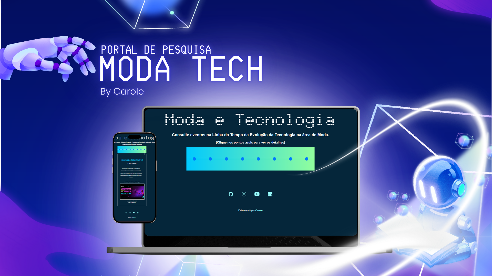
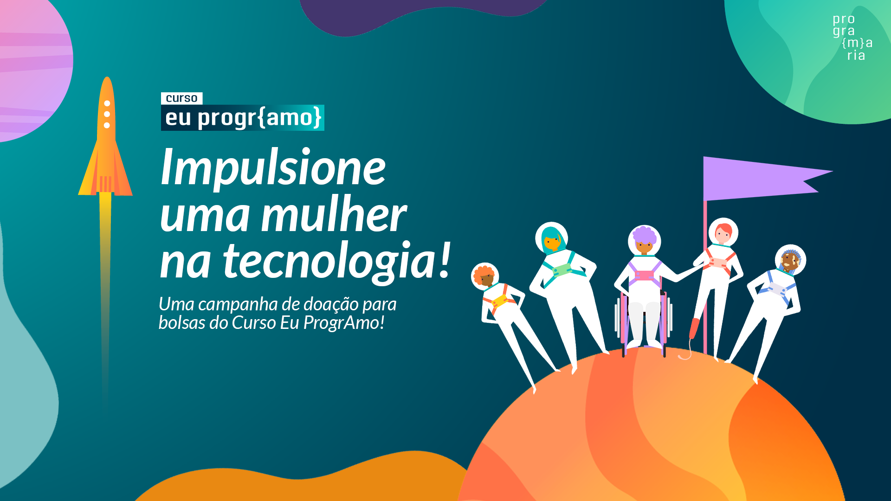

Projeto desenvolvido com bolsa de estudos no curso para iniciantes em Tech- "Frontend- Minha primeira página Web!", promovido pela PrograMaria, Escola Online de Tecnologia focada em empoderar mulheres e gêneros minorizados por meio da Tecnologia.

  <a href="#-tecnologias">Tecnologias</a>&nbsp;&nbsp;&nbsp;|&nbsp;&nbsp;&nbsp;
  <a href="#-projeto">Projeto</a>&nbsp;&nbsp;&nbsp;|&nbsp;&nbsp;&nbsp;
  <a href="#-layout">Layout</a>&nbsp;&nbsp;&nbsp;|&nbsp;&nbsp;&nbsp;

  

## 🤖 Tecnologias

Esse projeto foi desenvolvido com as seguintes tecnologias:

- HTML e CSS
- JavaScript
- Git e Github

## 💻 Projeto

Moda e Tecnologia é um site de pesquisa sobre a evolução do setor. Através da linha do tempo interativa é possível acessar artigos, vídeos e exposições virtuais que mostram como a tecnologia transforma o vestir na História da Humanidade. Curadoria de Conteúdo feita por <a href="https://www.linkedin.com/in/carole-67a7a9a6" target="blank">Carole.</a>

## 🔖 Layout

Você pode visualizar o layout do projeto através [DESSE LINK](https://www.canva.com/design/DAG-CEQE8ss/FTEaS7oZglemcAhTxBjAkg/edit?utm_content=DAG-CEQE8ss&utm_campaign=designshare&utm_medium=link2&utm_source=sharebutton).

---
<!--START_SECTION:footer-->
 
 

  <a href="https://www.programaria.org/cursos-programaria/front-end-primeira-pagina-web/">
 
    
  Curso progra[m]aria "Front-end: minha primeira página Web!"</a>
   
   
  Feito com ♥ by <a href="https://www.instagram.com/jemappellecarole/" target="blank">Carole.</a>

